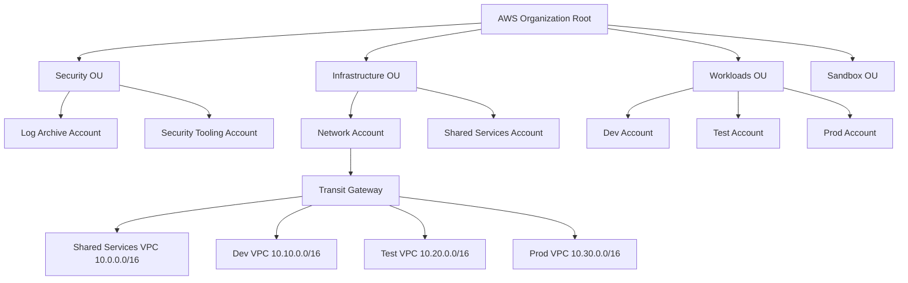
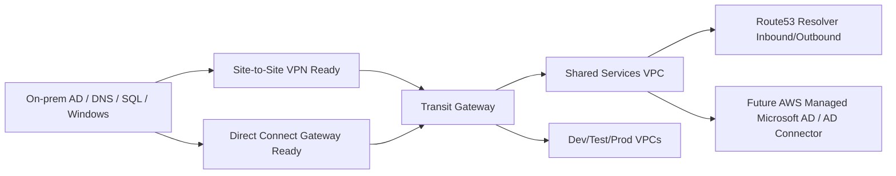

# Terraform AWS Enterprise Landing Zone

Production-grade Terraform starter for an AWS Landing Zone that supports migration of five on-premises Windows and SQL Server VMs to AWS.

Primary region: `us-east-2`  
Future DR region: `us-west-2`

## Architecture





## Repository Layout

```text
terraform-aws-landingzone/
├── modules/
│   ├── backup/
│   ├── compute/
│   ├── dns_resolver/
│   ├── dr/
│   ├── endpoints/
│   ├── hybrid_connectivity/
│   ├── iam_baseline/
│   ├── logging/
│   ├── mgn_readiness/
│   ├── network_vpc/
│   ├── organization/
│   ├── security/
│   ├── transit_gateway/
│   └── vpn/
├── environments/
│   ├── dev/
│   ├── test/
│   └── prod/
├── global/
│   ├── bootstrap/
│   ├── organization/
│   ├── security/
│   └── network/
├── policies/
├── pipelines/
├── scripts/
└── README.md
```

## Deployment Sequence

1. Configure an AWS management account profile with permission to create Organizations, accounts, IAM, S3, KMS, and DynamoDB.
2. Deploy `global/bootstrap` once to create the Terraform state S3 bucket and DynamoDB lock table.
3. Update every `backend.tf` with the created state bucket/table names.
4. Deploy `global/organization` from the management account.
5. Deploy `global/security` after account IDs are available.
6. Deploy `global/network` from the network account deployment role.
7. Deploy `environments/dev`, `environments/test`, then `environments/prod` from each workload account deployment role.

## Bootstrap

```powershell
cd global/bootstrap
terraform init
terraform plan -var-file="terraform.tfvars.example"
terraform apply -var-file="terraform.tfvars.example"
```

Then configure remote state:

```powershell
terraform init -migrate-state
terraform fmt -recursive
terraform validate
```

## Environment Deployment

```powershell
cd environments/prod
terraform init
terraform plan -var-file="terraform.tfvars.example"
terraform apply -var-file="terraform.tfvars.example"
```

## Security Baseline

The baseline enables organization-ready CloudTrail, AWS Config, GuardDuty, Security Hub, IAM Access Analyzer, Inspector, Macie, encrypted log archive buckets, VPC Flow Logs, AWS Backup vaults, and least-privilege deployment roles. SCP examples are in `policies/`.

## DR Strategy

Initial deployment is DR-ready but does not run duplicate workloads in `us-west-2`. The `dr` module prepares KMS keys, backup copy configuration, optional S3 CRR, Route53 failover records, and EBS snapshot copy hooks for future enablement.

## Cost Optimization

- Use one NAT Gateway per AZ for production resilience; lower environments may set `enable_single_nat_gateway = true`.
- Use gp3 for Windows OS volumes and io2 only for SQL data/log volumes.
- Enable lifecycle transitions for logs and backups.
- Right-size migrated instances after CloudWatch metrics and MGN test launches.
- Use VPC endpoints to reduce NAT data processing where private workloads call AWS APIs.

## Operational Excellence

- Use GitHub Actions pipeline in `pipelines/github-actions.yml`.
- Run `terraform fmt`, `terraform validate`, `tfsec`, and `checkov` on every pull request.
- Keep account IDs, role names, and backend values outside committed production tfvars.
- Use AWS Systems Manager Session Manager instead of inbound RDP where possible.
- Rotate break-glass credentials and test restore/runbook procedures quarterly.

## Mandatory Tags

Every module accepts `tags` and enforces these keys:

- `Environment`
- `Application`
- `Owner`
- `CostCenter`
- `Compliance`
- `BackupPolicy`

## Notes

Some organization-wide services have delegated administrator workflows that require the management account and service-linked roles. Treat this repository as an enterprise implementation baseline and run it through your security review, account vending process, and change management before production use.
